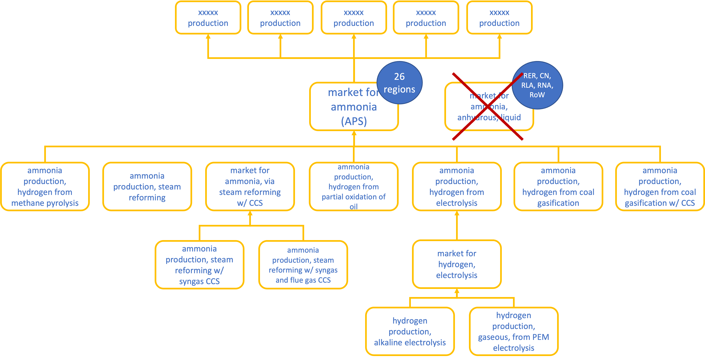

# ammonia-prospective-scenarios  [](https://zenodo.org/badge/latestdoi/527206370)


Description
-----------

This is a repository containing scenarios that implement the projections developed
in the Master thesis study of Johanna Boyce for:

* ammonia. 

It is meant to be used in `premise` in addition to a global IAM scenario, 
to provide refined projections for the future supply of ammonia for 
each IAM region. 

Note that projections regarding regional ammonia markets stop at 2050.
Any `premise` database with a reference year beyond 2050 
will use projections for 2050.

This data package contains all the files necessary for `premise` to implement
this scenario and create market- and region specific technology supply shares
for ammonia.

Sourced from publication
------------------------

Boyce, J. C. (2022). Ammonia decarbonisation pathways and their effects 
on life cycle assessments: Integrating future ammonia scenarios 
into background data for prospective LCAs. Master’s Thesis, 
Leiden University and TU Delft.

Data validation 
---------------

[](https://goodtables.io//github/premise-community-scenarios/ammonia-prospective-scenarios)

Test 
----


Ecoinvent database compatibility
--------------------------------

ecoinvent 3.8 cut-off

IAM scenario compatibility
---------------------------

The following coupling is done between IAM scenarios and the ammonia market scenarios (APS):

| IAM scenario           | APS scenario            |
|------------------------|-------------------------|
| IMAGE SSP2-Base        | Business As Usual       |
| IMAGE SSP2-RCP26       | Sustainable development |
| IMAGE SSP2-RCP19       | Sustainable development |
| REMIND SSP2-Base       | Business As Usual       |
| REMIND SSP2-PkBudg1150 | Sustainable development |
| REMIND SSP2-PkBudg500  | Sustainable development |

What does this do?
------------------

This external scenario update the ecoinvent market for ammonia, according
to the projections described in the Master thesis study of J. Boyce, 2022.

Ammonia
*******

The following markets are introduced:

* `market for ammonia, via steam reforming w/ CCS (APS)`
* `market for hydrogen, electrolysis (APS)`
* `market for ammonia (APS)`

`market for ammonia (APS)` is supplied by seven ammonia production pathways:
* MP (Methane Pyrolysis), called `ammonia production, hydrogen from methane pyrolysis`,
* SMR (Steam Methane Reforming), called `ammonia production, steam reforming`,
* SMRC (SMR with CCS), called `market for ammonia, via steam reforming w/ CCS`,
* ELE (electrolysis), called `ammonia production, hydrogen from electrolysis`,
* OIL (Partial oxidation of oil), called `ammonia production, hydrogen from partial oxidation of oil`,
* CG (coal gasification), called `ammonia production, hydrogen from coal gasification`,
* CGC (CG with CCS), called `ammonia production, hydrogen from coal gasification w/ CCS`.

This market re-links to activities that consume ammonia throughout the database.

Hydrogen
********

The following market is introduced:

* `market for hydrogen, electrolysis (APS)`

It is supplied by two hydrogen production pathways:
* AE (alkaline electrolysis), and 
* PEM electrolysis

This market re-links to ammonia-producing activities 
that consume hydrogen throughout the database.


Flow diagram
------------



How to use it?
--------------

```python

    import brightway2 as bw
    from premise import NewDatabase
    from datapackage import Package
    
    
    fp = r"https://raw.githubusercontent.com/premise-community-scenarios/ammonia-prospective-scenarios/main/datapackage.json"
    ammonia = Package(fp)
    
    bw.projects.set_current("your_bw_project")
    
    ndb = NewDatabase(
            scenarios = [
                {"model":"image", "pathway":"SSP2-Base", "year":2050,},
                {"model":"image", "pathway":"SSP2-RCP26", "year":2030,},
            ],        
            source_db="ecoinvent 3.8 cutoff",
            source_version="3.8",
            key='xxxxxxxxxxxxxxxxxxxxxxxxxxxxxxxxxxx',
            external_scenarios=[
                ammonia, # <-- list datapackages here
            ] 
        )
```

